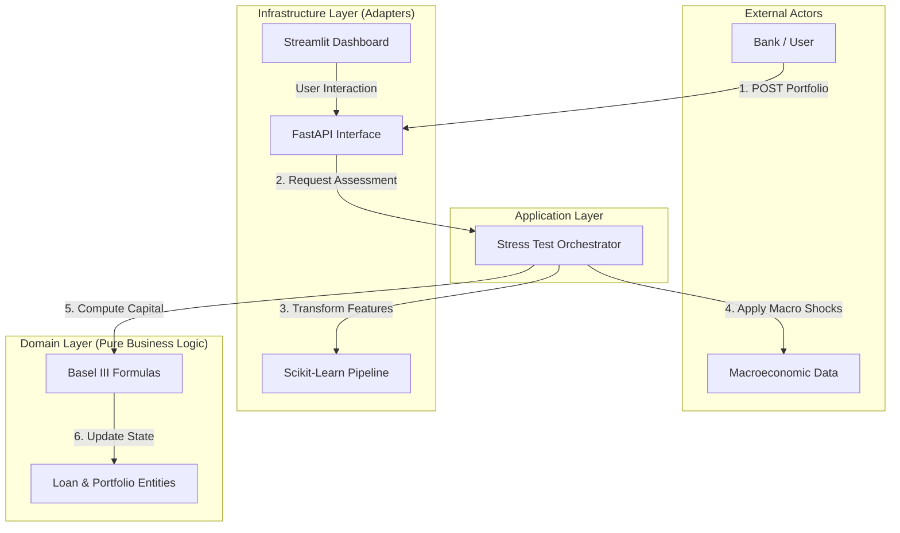

# **Prudentia – Basel III/IV Quantitative Risk Engine**

> *A next-generation industrial-grade risk engine bridging Quantitative Finance, Regulatory Compliance, and Modern Software Engineering.*

---

## **Executive Summary**

Prudentia automatizes the end-to-end credit-risk lifecycle, delivering a fully compliant and explainable framework aligned with Basel III/IV and European Banking Authority (EBA) expectations.

It addresses three core supervisory and banking needs:

### **1. Credit Scoring (IRB PD Model)**
- Logistic Regression with **Weight of Evidence (WoE)** encoding
- Monotonic & interpretable scorecard-style modeling
- SME / Large Corporate scaling

### **2. Regulatory Capital Calculation (Basel ASRF)**
- Computation of **RWA**, **Expected Loss (EL)**, and **Capital Requirement (K)**
- Fully compliant with **A-IRB** formulas
- Pure mathematical domain kernel (no external deps)

### **3. Stress Testing Engine**
- Macroeconomic scenario application (GDP, Unemployment, Inflation)
- **Probit-Shift methodology** per EBA guidelines
- Portfolio solvency simulation under extreme but plausible shocks

---

## **Interactive Dashboard (UI)**

Prudentia includes a fully interactive **Streamlit interface** allowing users to explore risk calculations visually and intuitively — without writing any code.

### **Key Capabilities**
- Real-time configuration of PD, LGD, Maturity, Exposure  
- Scenario switching (Baseline → Adverse → Severe)  
- Instant visualization of:
  - Stressed PD (Probit Shift)
  - Capital Requirement (K)
  - RWA impact
  - Portfolio solvency trajectory  

### **Run the UI**
```bash
python -m streamlit run app.py
```

Accessible at:
```
http://localhost:8501
```

---

## **Architectural Overview**

Prudentia adopts a strict **Hexagonal Architecture (Ports & Adapters)** ensuring maintainability, testability, and regulatory auditability.

```
Domain (Core Math)
│
├── Application (Orchestration)
│
└── Infrastructure (APIs, ML, IO, UI)
```

### **Why Hexagonal?**
- The Basel math **never depends** on ML or FastAPI.
- Regulatory logic remains **frozen, deterministic, validated**.
- Infrastructure can evolve freely (APIs, pipelines, cloud deployment).

---

## **System Diagram (Mermaid)**



---

# **Quantitative Framework (Mathematics)**

Prudentia implements the **Asymptotic Single Risk Factor (ASRF)** model underlying Basel A-IRB.

---

## **1. Asset Correlation (R)**

> High-quality borrowers are more correlated with systemic risk.

### Corporate exposures:
$$
R = 0.12 \cdot \frac{1 - e^{-50PD}}{1 - e^{-50}}
  + 0.24 \cdot \left[1 - \frac{1 - e^{-50PD}}{1 - e^{-50}}\right]
$$

---

## **2. Maturity Adjustment (b, MF)**

### Smoothing factor:
$$
b = (0.11852 - 0.05478\ln(PD))^2
$$

### Final maturity factor:
$$
MF = \frac{1 + (M - 2.5)b}{1 - 1.5b}
$$

---

## **3. Capital Requirement (K)** – Vasicek ASRF

$$
K = \Bigg[
LGD \cdot \Phi\left(
\frac{\Phi^{-1}(PD) + \sqrt{R}\Phi^{-1}(0.999)}{\sqrt{1-R}}
\right)
- LGD \cdot PD
\Bigg] \cdot MF
$$

Where:
- $\Phi$ = Standard Normal CDF  
- $\Phi^{-1}$ = Normal inverse CDF  

---

## **4. Stress Testing – Probit Shift**

$$
PD_{stressed} =
\Phi\left(
\Phi^{-1}(PD_{base}) + Sensitivity \cdot Z_{scenario}
\right)
$$

This ensures a **coherent deformation** of PDs under recessionary shocks.

---

# **Machine Learning Approach**

Regulators require transparency over raw predictive power.

### Prudentia uses:

- Logistic Regression  
- Weight of Evidence (WoE) binning  
- Monotonic constraints  

### Benefits

- Fully explainable  
- Governance-ready for ACPR / ECB  
- Robust handling of missing values  

---

# **Installation & Usage**

## **Prerequisites**
- Python **3.10+**
- Poetry (recommended)

---

## **1. Clone repository**
```bash
git clone https://github.com/YOUR_USERNAME/prudentia-risk-engine.git
cd prudentia-risk-engine
```

## **2. Install dependencies**
```bash
poetry install
```

## **3. Train the model**
```bash
python -m src.scripts.train_model
# → Model saved to data/models/scorecard_model.pkl
```

## **4. Launch the Engine (API)**
```bash
python -m uvicorn src.api.main:app --reload
```

## **5. Swagger Documentation**
```
http://127.0.0.1:8000/docs
```

## **6. Launch Full Application (API + UI)**

### Terminal 1 — FastAPI Engine  
```bash
python -m uvicorn src.api.main:app --reload
```

### Terminal 2 — Streamlit UI  
```bash
python -m streamlit run app.py
```

Available at:
- API Docs → http://127.0.0.1:8000/docs  
- Dashboard → http://localhost:8501  

---

# **Project Structure**

```
src/
├── domain/               # CORE MATHEMATICAL KERNEL
│   ├── entities.py       # Loan / Portfolio Models
│   └── basel_formulas.py # ASRF & Basel Calculations
├── engine/               # ORCHESTRATION LOGIC
│   └── stressor.py       # Stress Testing Engine
├── processing/           # DATA ENGINEERING
│   └── woe_encoder.py    # WoE Transformer
├── api/                  # REST INTERFACE
│   └── main.py           # FastAPI Endpoints
└── scripts/              # OPERATIONS / PIPELINES
    └── train_model.py

app.py                    # STREAMLIT USER INTERFACE
```

---

# **Continuous Integration (CI)**

GitHub Actions ensure reliability:

- **Ruff** — Linting  
- **MyPy** — Static type checking  
- **Pytest** — Mathematical & functional validation  

---

# **License**

Distributed under the **MIT License**.

---

> *Prudentia – Because risk engines deserve elegance too.*
